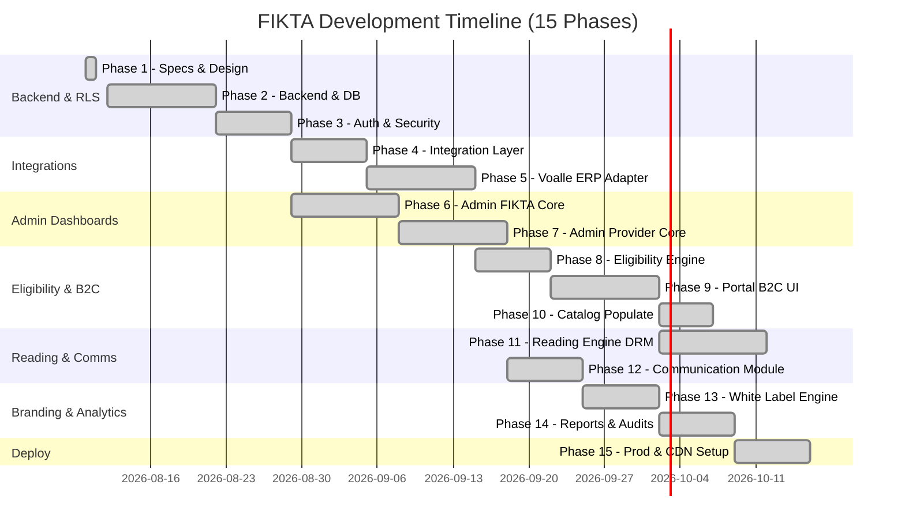

# FIKTA - Implementation Roadmap

This roadmap outlines the sequence of phases and deliverables required to build the FIKTA B2B2C platform.

---

## Roadmap Phases

---

## Detailed Deliverables by Phase

### Phase 1: Architecture Specifications
- **Objective**: Establish the technical foundations, security boundaries, and architectural patterns.
- **Deliverables**:
  - [x] Tech stack definition and topology diagram (`ARCHITECTURE.md`).
  - [x] Multi-tenancy isolation policies and RLS strategies (`MULTI-TENANCY.md`).
  - [x] User profiles permissions mapping (`ROLES-AND-PERMISSIONS.md`).
  - [x] Relational database schemas & indices design (`DATABASE.md`).
  - [x] Project roadmap planning (`ROADMAP.md`).
  - [x] Core operational rules formulation (`BUSINESS-RULES.md`).
  - [x] ERP Integration interfaces and Voalle adapter plan (`INTEGRATIONS.md`).
  - [x] Eligibility Engine assessment workflow (`ELIGIBILITY.md`).
  - [x] Communication module templates framework (`COMMUNICATIONS.md`).

---

### Phase 2: Backend and Database Setup
- **Objective**: Create the server application structure using ASP.NET Core Web API (C#) and verify database migrations.
- **Deliverables**:
  - [x] Docker Compose file containing PostgreSQL and Redis.
  - [x] Initialize Clean Architecture solution (`Fikta.sln` with API, Application, Domain, Infrastructure projects).
  - [x] Setup DbContext with Global Query Filters (for implicit tenant isolation) and PostgreSQL RLS initialization.
  - [x] Setup base DB Migrations via EF Core.
  - [x] Setup Swagger/OpenAPI with Bearer Authorization documentation.

---

### Phase 3: Authentication and Authorization
- **Objective**: Implement secure stateless user logins and RBAC context validation.
- **Deliverables**:
  - [x] Auth login endpoints (`/api/v1/auth/login`, `/api/v1/auth/refresh`).
  - [x] JWT generation using claims (`userId`, `tenantId`, `providerId`, `role`).
  - [x] AspNetCore TenantContext middleware (injects resolved scopes into `ITenantContext`).
  - [x] Authorization guards / Policy handlers checking roles on controller routes.

---

### Phase 4: Integration Layer Foundation
- **Objective**: Define core abstractions for external systems and credentials management.
- **Deliverables**:
  - [x] Implement `IExternalCustomerProvider`, `IExternalFinancialProvider`, etc.
  - [x] Create credential encryption utilities (AES-256) inside Domain/Infrastructure.
  - [x] Create base generic HTTP service client supporting Resilience (Polly: timeout, retries).
  - [x] Integration configuration CRUD APIs for Super Admins.

---

### Phase 5: ERP Adapter: Voalle
- **Objective**: Implement a fully operational adapter for the Voalle Third-Party Web Services.
- **Deliverables**:
  - [x] Voalle Authenticator service (obtaining and caching Bearer Token with Syndata).
  - [x] Customer Import endpoints mapping Voalle Pf/Pj profiles to core models.
  - [x] Voalle Contract and Service status query client.
  - [x] Integration validation test suite mocking Voalle API endpoints.

---

### Phase 6: Admin FIKTA (Platform Owner)
- **Objective**: Build the visual panels for FIKTA administrators using Tailwind Admin.
- **Deliverables**:
  - [x] FIKTA Dashboard Home (global statistics and provider analytics).
  - [x] Provider Onboarding interface (CNPJ, Domain registry, Status toggles).
  - [x] Global Catalog management dashboard (manage Books, Authors, Categories, Publishers).
  - [x] Supplier contracts and licensing manager.

---

### Phase 7: Admin Provider (Tenant Dashboard)
- **Objective**: Build the administrative portal for ISPs to manage their tenant platform.
- **Deliverables**:
  - [x] Provider Home Dashboard (active local users, library adds, consumption rates).
  - [x] Customer Onboarding and list manager.
  - [x] Local Catalog whitelist control (enable/disable books from FIKTA master list).
  - [x] Integration Configuration interface (set up ERP URLs and Credentials).

---

### Phase 8: Eligibility Engine
- **Objective**: Design the dynamic catalog access motor.
- **Deliverables**:
  - [x] Core Eligibility service verifying Provider, Customer, and Contract mapping.
  - [x] Database schema and mapping controller for `ExternalProductMapping` and `CatalogAccessRule`.
  - [x] Parametric financial check logic (GracePeriodDays, MaxOverdueTitles validation).
  - [x] Access token eligibility interceptor executing checks during sessions.

---

### Phase 9: Portal B2C (Customer Interface)
- **Objective**: Build the B2C user portal based on Bookly design for catalog browsing.
- **Deliverables**:
  - [x] Portal Home page (carousels, highlights, and custom categories).
  - [x] Catalog search and advanced filtering (by genre, author, publisher).
  - [x] Category index pages.
  - [x] Book details view (synopsis, author details, "Add to Library" call to action).

---

### Phase 10: Catalog Populate & Synchronizers
- **Objective**: Bulk import content and maintain hierarchy indices.
- **Deliverables**:
  - [x] JSON/XML file importer for catalog suppliers.
  - [x] Postgres Full-Text search queries optimization.
  - [x] Catalog category hierarchy parser.

---

### Phase 11: Digital Reading Engine
- **Objective**: Build a high-quality reader inside the browser with DRM protection.
- **Deliverables**:
  - [x] Client EPUB reader page using `epub.js` (flowing layout, custom themes).
  - [x] Client PDF reader using `pdf.js`.
  - [x] Reading progress synchronizer API (`/api/v1/reader/progress`).
  - [x] Watermarking & DRM stream security filter (preventing raw file URL leakage).

---

### Phase 12: Production Readiness & Observability
- **Objective**: Prepare the platform for enterprise multi-tenant deployment.
- **Deliverables**:
  - [x] End-to-end Voalle API integration tests and live controller (`ErpIntegrationController`).
  - [x] Real-time latency measurement and Circuit Breaker telemetry.
  - [x] Per-tenant white-label branding resolution engine.
  - [x] Executive Maturity & Architecture Improvement Guide (`MATURITY-AND-IMPROVEMENTS-GUIDE.md`).
  - [x] Signed S3 temporary URLs generator (valid for 5 minutes).
  - [x] Reading progress sync api (saves last page read and time spent).

---

### Phase 12: Communication Module
- **Objective**: Launch the email notification and queue delivery systems.
- **Deliverables**:
  - [x] Database structures for `email_templates`, `email_deliveries`, and `email_delivery_logs`.
  - [x] Dynamic template parser replacing `{{Placeholder}}` variables.
  - [x] Background mail worker consuming pending items queue.
  - [x] Out-of-the-box support for Password Reset and Catalog Campaign emails.

---

### Phase 13: White Label Mechanics
- **Objective**: Enforce custom tenant branding dynamically.
- **Deliverables**:
  - [x] Domain/subdomain resolver middleware in ASP.NET Core.
  - [x] Dynamic brand loader returning logo, favicons, and CSS variables.
  - [x] Custom CSS variables injector in React portals.

---

### Phase 14: Reports and Analytics
- **Objective**: Provide statistics, auditing logs, and billing details.
- **Deliverables**:
  - [x] Global usage logs and action auditing logs.
  - [x] Monthly consumption reports per provider (for billing).
  - [x] Dashboard graphics integration in frontend.

---

### Phase 15: Production Deployment
- **Objective**: Deploy the system in a secure, stable cloud environment.
- **Deliverables**:
  - [x] CI/CD pipeline automation (Github Actions).
  - [x] Let's Encrypt SSL certificates automation.
  - [x] Private AWS S3 bucket and CloudFront CDN setup.
  - [x] Active system monitoring and alerting logs.
