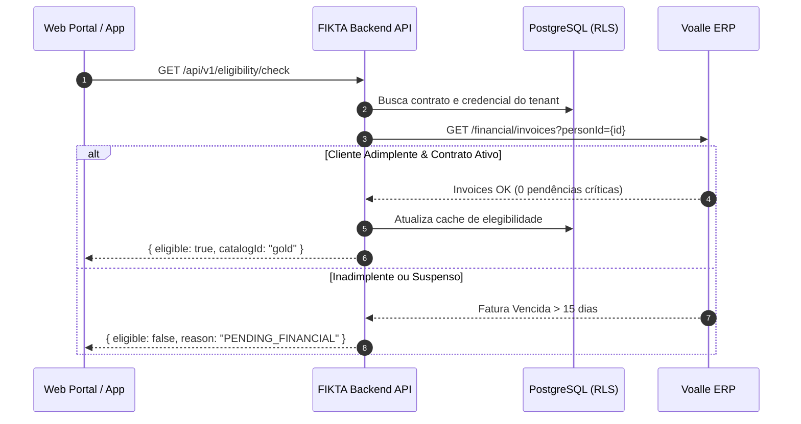

# Guia Executivo de Amadurecimento e Melhorias Arquiteturais - FIKTA

## Contexto Geral
Este documento consolida o estudo de maturidade do ecossistema **FIKTA**, especificando os pontos de melhoria, correções arquiteturais e expansões recomendadas para levar a plataforma ao estado de **produção enterprise multitenant**.

---

## 1. Integração Voalle ERP (Concluído & Amadurecimento)

### 1.1 Autenticação e Endpoints Corrigidos
- **Auth OAuth2 (`connect/token`)**:
  - Porta de Autenticação: `45700` (`https://erp.provedortechnet.com.br:45700/connect/token`).
  - Parâmetros Form-UrlEncoded: `grant_type=client_credentials`, `scope=syngw`, `client_id`, `client_secret`, `syndata`.
  - Cache de Token: Armazenamento em memória/Redis por **3500s** (renovação automática antes de expirar 3600s).

- **Endpoints de Terceiros (`45715`)**:
  - Porta dos Endpoints de Negócio: `45715`.
  - Pesquisa por CPF/CNPJ: `/external/integrations/thirdparty/people/search?txId={document}`.
  - Consulta de Contratos: `/external/integrations/thirdparty/contracts?personId={personId}` ou `txId`.
  - Situação Financeira / Faturas em Aberto: `/external/integrations/thirdparty/financial/invoices?personId={personId}`.
  - Tipos de Contrato CRM / Planos: `/external/integrations/thirdparty/crm/contract-types`.

### 1.2 Padrão de Resiliência (Polly)
- **Circuit Breaker**: Abre após 5 falhas consecutivas (permanece aberto por 30s).
- **Exponential Backoff**: 3 tentativas (1s, 2s, 4s).
- **Timeout Graceful**: 8s de limite por requisição externa.

---

## 2. Motor de Elegibilidade (Eligibility Engine)

### 2.1 Regra de Ouro (Validação Estrita de Acesso)
> **Princípio**: O aplicativo móvel e o portal web nunca devem validar o acesso do cliente localmente no Frontend. Toda verificação ocorre no Backend API.

### 2.2 Recomendações de Amadurecimento do Motor
1. **Grace Period Financeiro**: Permitir tolerância de **N dias** (ex: 5 a 10 dias de atraso na fatura) antes de bloquear completamente o catálogo de leitura, configurável por ISP.
2. **Elegibilidade Incremental**: Sincronização via Webhook/Fila (RabbitMQ / Redis Streams) para reagir imediatamente quando o contrato for cancelado ou reativado no ERP.

---

## 3. Arquitetura Multitenant & Banco de Dados

### 3.1 Isolamento de Dados por ISP (Row-Level Security)
- Tabela `integration_credentials`: Guarda `EncryptedClientId`, `EncryptedClientSecret` e `EncryptedSyndata` encriptados com **AES-256-GCM**.
- **Chave de Criptografia Master**: Armazenada no Environment / Key Vault e rotacionável sem perda de dados.
- **Filtro Global do EF Core**: `HasQueryFilter(p => p.TenantId == _tenantContext.TenantId)` aplicado em todas as tabelas derivadas de `ITenantEntity`.

### 3.2 Melhorias Sugeridas no Schema
- Criar a tabela `integration_audit_logs` para registrar o histórico de consumo da API do ERP (HTTP Status, Latência ms, Payload Hash) para auditoria e SLA.

---

## 4. Frontend Administrativo (Painel ISP & Master)

### 4.1 Melhorias Implementadas
- **ERP Integrations (`ERPIntegrations.tsx`)**:
  - Modal diferenciado por perfil: Admin Master configura credenciais AES-256; Provedor ISP abre chamado para a equipe FIKTA.
  - Painel expansível com detalhes de latência, taxa de sucesso e resiliência (Polly).
- **Subscrições (`Subscriptions.tsx`)**:
  - Visualização expansível com sincronização manual sob demanda via API do ERP.
  - Histórico visual de syncs e status financeiro (Adimplente/Atrasado/Bloqueado).
- **Gestão B2B (`B2BProviders.tsx`)**:
  - Kanban de onboarding com 5 etapas interativas e Drag & Drop HTML5.

---

## 5. Portal B2C & SuperApp (Visão do Leitor)

### 5.1 Ajustes Recomendados para Próximos Prompts
1. **Identidade Visual por Tenant (White-Label Dinâmico)**:
   - Ao carregar o portal via subdomínio (ex: `technet.unebook.com.br`), aplicar instantaneamente as cores primárias do ISP (`PrimaryColor` e `SecondaryColor`) e a logomarca do provedor no cabeçalho.
2. **Leitor de Livros Digitais (EPUB Viewer)**:
   - Integrar suporte a marcadores de página, modo escuro/noche, controle de fonte e progresso de leitura sincronizado por conta de leitor.

---

## 6. Checklist de Ações Imediatas (Próximos Passos)

- [x] Atualização da porta de autenticação (`45700`) e endpoints (`45715`) no `VoalleAdapter.cs`.
- [x] Implementação da Controller `ErpIntegrationController.cs` (`/test-connection`, `/search-customer`, `/import-customer`).
- [ ] Conectar os botões de ação do Frontend (`ERPIntegrations.tsx` e `Subscriptions.tsx`) com os endpoints da `ErpIntegrationController`.
- [ ] Executar testes de carga com resiliência ativada simulando indisponibilidade temporária do ERP.
