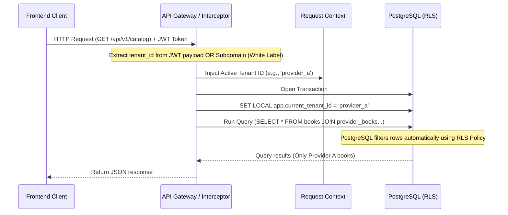

# FIKTA - Multi-Tenancy Architecture Spec

This document details the Multi-Tenancy model, data isolation strategies, and tenant context resolution for the FIKTA platform.

---

## 1. Multi-Tenancy Hierarchy Model

The platform architecture is built around three distinct structural tiers:

```
                  ┌──────────────────────────────┐
                  │        PLATFORM OWNER        │
                  │        (FIKTA)         │
                  └──────────────┬───────────────┘
                                 │
                 ┌───────────────┴───────────────┐
                 ▼                               ▼
     ┌───────────────────────┐       ┌───────────────────────┐
     │  TENANT B2B (Prov A)  │       │  TENANT B2B (Prov B)  │
     └───────────┬───────────┘       └───────────┬───────────┘
                 │                               │
         ┌───────┴───────┐                       ▼
         ▼               ▼               ┌───────────────┐
     ┌───────┐       ┌───────┐           │  CUSTOMER B1  │
     │Cust A1│       │Cust A2│           └───────────────┘
     └───────┘       └───────┘
```

1. **Platform Owner (FIKTA)**:
   - Holds global administrative privileges.
   - Manages the master digital book catalog, authors, categories, publishers, and supplier contracts.
   - Onboards and manages B2B Tenants (Providers).
   - Views global system reports and usage metrics.

2. **B2B Tenant (Provider)**:
   - Represents a specific Internet Service Provider (ISP).
   - Functions as an isolated, independent entity.
   - Customizes its platform presentation (White Label: domain, colors, logo).
   - Manages its own database of final Customers (B2C Users).
   - Activates specific books from the global catalog for its customers.

3. **B2C Customer (End-User)**:
   - End-user who consumes the digital books.
   - Belongs to **exactly one** B2B Tenant (Provider).
   - Can only access books explicitly whitelisted/purchased by their Provider.

---

## 2. Database Isolation Strategy Analysis

To determine the best multi-tenant architecture, three industry-standard models were evaluated:

| Strategy | Pros | Cons | Decision for FIKTA |
| :--- | :--- | :--- | :--- |
| **Database per Tenant** | • Absolute data isolation.<br>• Custom backups per tenant. | • High infrastructure cost.<br>• Very difficult to maintain global catalog.<br>• Hard to run schema migrations. | **Rejected**: Violates the requirement of a single, shared global book catalog. |
| **Schema per Tenant (PostgreSQL schemas)** | • Good logical isolation.<br>• Shared database resources. | • Replicating tables makes global catalog queries complex.<br>• High connection pool usage. | **Rejected**: Global catalog joins with local tenant libraries become highly complex. |
| **Shared Database & Shared Schema (with Tenant Discriminator)** | • Lowest hosting & maintenance cost.<br>• Easy global reporting for FIKTA.<br>• Simple global book catalog relation. | • Risk of data leakage if queries are written incorrectly. | **Selected (with RLS)**: Ideal for a centralized global catalog and White Label structure. |

### Technical Decision: Shared Database with PostgreSQL Row-Level Security (RLS)

To mitigate the risk of data leakage inherent in a shared schema database, we recommend **PostgreSQL Row-Level Security (RLS)**.

1. Every tenant-specific table (e.g., `providers`, `customers`, `users`, `library_progress`) will include a `tenant_id` column.
2. In PostgreSQL, RLS policies will restrict SELECT, UPDATE, and DELETE operations based on the active session's tenant context:
   ```sql
   ALTER TABLE customers ENABLE ROW LEVEL SECURITY;
   
   CREATE POLICY customer_tenant_isolation ON customers
     USING (tenant_id = current_setting('app.current_tenant_id', true))
     WITH CHECK (tenant_id = current_setting('app.current_tenant_id', true));
   ```
3. For global tables (e.g., `books`, `authors`, `categories`), RLS is either disabled or configured to allow read access to all tenants, but write access only to the FIKTA master context.

---

## 3. Tenant Context Resolution Flow

A request's tenant context must be resolved dynamically at runtime for every incoming HTTP request.



### Context Resolution Steps:
1. **Identification**:
   - For B2B Admin routes: Resolved via `tenant_id` contained inside the administrator's JWT claims.
   - For B2C Portal routes: Resolved via the request's origin host header (subdomain/domain mapping) or the customer's JWT token payload which contains `provider_id` as their active `tenant_id`.
2. **Context Injection**:
   - The backend middleware grabs this ID and places it into the execution thread's local storage (e.g., AsyncLocalStorage in Node.js).
3. **Database Execution**:
   - The ORM or database driver reads the context and executes `SET LOCAL app.current_tenant_id = '...'` inside the transaction before firing queries.

---

## 4. Tenant Isolation Verification Rules

- **Write Operations**: The `tenant_id` is automatically set by the backend based on the context. The client cannot manually submit or change the `tenant_id` parameter in POST/PUT payloads.
- **Cross-Tenant Queries**: If an administrator from `Provider A` attempts to request client details for `Client B1` (from `Provider B`), the database RLS will cause a `404 Not Found` or `Access Denied` error naturally, preventing code-level bugs from leaking data.
- **Multi-Tenant Global Catalog (`ProviderBook`)**:
  - The relation table `ProviderBook` acts as the bridge. A query fetching a tenant's catalog will look like:
    ```sql
    SELECT * FROM books b
    INNER JOIN provider_books pb ON b.id = pb.book_id
    WHERE pb.tenant_id = current_setting('app.current_tenant_id');
    ```
  - This ensures customers only see books assigned to their respective provider.
