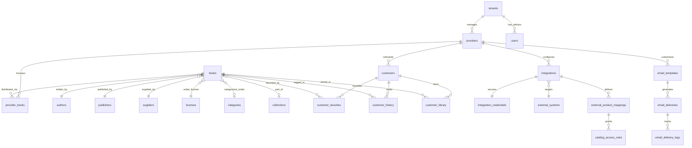

# FIKTA - Conceptual Database Model

This document defines the relational database schema, tables, fields, and relationships designed for PostgreSQL.

---

## 1. Entity Relationship Diagram (ERD)

---

## 2. Table Specifications

### 2.1. System & Tenancy Tables

#### `tenants`
Tracks the tenant entities (FIKTA master and each Provider B2B).
- `id` (UUID, PK)
- `type` (VARCHAR) — `PLATFORM` (FIKTA) or `PROVIDER`
- `status` (VARCHAR) — `ACTIVE`, `SUSPENDED`
- `created_at` (TIMESTAMP)
- `updated_at` (TIMESTAMP)

#### `providers`
Contains business information for each ISP.
- `id` (UUID, PK)
- `tenant_id` (UUID, FK -> `tenants.id`)
- `name` (VARCHAR) — Commercial name
- `company_name` (VARCHAR) — Razão Social
- `cnpj` (VARCHAR, UNIQUE) — CNPJ
- `status` (VARCHAR) — `ACTIVE`, `SUSPENDED`
- `logo_url` (VARCHAR)
- `domain` (VARCHAR, UNIQUE) — Custom sub-domain or full domain (e.g., `books.provider.com`)
- `primary_color` (VARCHAR) — Hex color code (e.g., `#51A8B1`)
- `secondary_color` (VARCHAR) — Hex color code
- `favicon_url` (VARCHAR)
- `settings` (JSONB) — White-label configurations and visual preferences
- `created_at` (TIMESTAMP)
- `updated_at` (TIMESTAMP)

#### `users`
Administrators and Operators of the platform (both FIKTA and Providers).
- `id` (UUID, PK)
- `tenant_id` (UUID, FK -> `tenants.id`)
- `name` (VARCHAR)
- `email` (VARCHAR, UNIQUE)
- `password_hash` (VARCHAR)
- `role` (VARCHAR) — `SUPER_ADMIN`, `UNE_ADMIN`, `UNE_OPERATOR`, `PROVIDER_ADMIN`, `PROVIDER_OPERATOR`
- `status` (VARCHAR) — `ACTIVE`, `SUSPENDED`
- `created_at` (TIMESTAMP)
- `updated_at` (TIMESTAMP)

---

### 2.2. B2C Customer Tables

#### `customers`
End-users registered under a Provider.
- `id` (UUID, PK)
- `provider_id` (UUID, FK -> `providers.id`)
- `name` (VARCHAR)
- `email` (VARCHAR) — Unique within each Provider context
- `phone` (VARCHAR)
- `password_hash` (VARCHAR)
- `status` (VARCHAR) — `ACTIVE`, `SUSPENDED`
- `created_at` (TIMESTAMP)
- `updated_at` (TIMESTAMP)
- *Composite Index*: `UNIQUE(provider_id, email)`

---

### 2.3. Catalog Tables

#### `authors`
- `id` (UUID, PK)
- `name` (VARCHAR)
- `bio` (TEXT)
- `created_at` (TIMESTAMP)

#### `publishers`
- `id` (UUID, PK)
- `name` (VARCHAR)
- `created_at` (TIMESTAMP)

#### `categories`
- `id` (UUID, PK)
- `name` (VARCHAR)
- `slug` (VARCHAR, UNIQUE)
- `parent_id` (UUID, FK -> `categories.id`) — For hierarchical categories
- `created_at` (TIMESTAMP)

#### `collections`
- `id` (UUID, PK)
- `name` (VARCHAR)
- `description` (TEXT)
- `created_at` (TIMESTAMP)

#### `suppliers`
- `id` (UUID, PK)
- `name` (VARCHAR) — Provider of the catalog content (e.g., Bookwire)
- `created_at` (TIMESTAMP)

#### `licenses`
- `id` (UUID, PK)
- `supplier_id` (UUID, FK -> `suppliers.id`)
- `contract_number` (VARCHAR)
- `start_date` (DATE)
- `end_date` (DATE)
- `max_activations` (INTEGER) — Max providers allowed to use this content
- `created_at` (TIMESTAMP)

#### `books`
Global catalog books details.
- `id` (UUID, PK)
- `title` (VARCHAR)
- `isbn` (VARCHAR, UNIQUE)
- `author_id` (UUID, FK -> `authors.id`)
- `publisher_id` (UUID, FK -> `publishers.id`)
- `category_id` (UUID, FK -> `categories.id`)
- `collection_id` (UUID, FK -> `collections.id`, NULLABLE)
- `supplier_id` (UUID, FK -> `suppliers.id`)
- `license_id` (UUID, FK -> `licenses.id`)
- `description` (TEXT)
- `cover_url` (VARCHAR)
- `file_url` (VARCHAR) — Private S3 reference path
- `file_format` (VARCHAR) — `EPUB` or `PDF`
- `status` (VARCHAR) — `ACTIVE`, `INACTIVE`
- `created_at` (TIMESTAMP)
- `updated_at` (TIMESTAMP)

#### `provider_books`
Determines which books are available to which Providers.
- `id` (UUID, PK)
- `provider_id` (UUID, FK -> `providers.id`)
- `book_id` (UUID, FK -> `books.id`)
- `status` (VARCHAR) — `ACTIVE`, `INACTIVE`
- `assigned_at` (TIMESTAMP)
- *Composite Index*: `UNIQUE(provider_id, book_id)`

---

### 2.4. Customer Reading & Library State Tables

#### `customer_library` (Book Shelf)
Books the customer has acquired or added to their personal list.
- `id` (UUID, PK)
- `customer_id` (UUID, FK -> `customers.id`)
- `book_id` (UUID, FK -> `books.id`)
- `added_at` (TIMESTAMP)
- *Composite Index*: `UNIQUE(customer_id, book_id)`

#### `customer_favorites`
- `id` (UUID, PK)
- `customer_id` (UUID, FK -> `customers.id`)
- `book_id` (UUID, FK -> `books.id`)
- `created_at` (TIMESTAMP)
- *Composite Index*: `UNIQUE(customer_id, book_id)`

#### `customer_history` (Reading Log / Progress)
- `id` (UUID, PK)
- `customer_id` (UUID, FK -> `customers.id`)
- `book_id` (UUID, FK -> `books.id`)
- `last_page_read` (INTEGER) — Page number (for PDF) or progress percentage/cfi (for EPUB)
- `percentage_completed` (DECIMAL(5,2)) — Progress percentage (0.00 to 100.00)
- `last_read_at` (TIMESTAMP)
- `time_spent_seconds` (INTEGER)
- *Composite Index*: `UNIQUE(customer_id, book_id)`

---

### 2.5. Integration & Mapping Tables

#### `external_systems`
Global registry of ERP platforms integrated into the system (e.g., Voalle).
- `id` (UUID, PK)
- `name` (VARCHAR, UNIQUE) — System name (e.g., `Voalle`, `SGP`, `IXC`)
- `adapter_class` (VARCHAR) — Assembly name/namespace of the adapter
- `created_at` (TIMESTAMP)

#### `integrations`
Active link mapping a Provider to an External System.
- `id` (UUID, PK)
- `provider_id` (UUID, FK -> `providers.id`)
- `external_system_id` (UUID, FK -> `external_systems.id`)
- `endpoint_url` (VARCHAR) — API Base endpoint for this tenant
- `status` (VARCHAR) — `ACTIVE`, `INACTIVE`
- `created_at` (TIMESTAMP)
- `updated_at` (TIMESTAMP)

#### `integration_credentials`
Encrypted configuration secrets for the integration connection.
- `id` (UUID, PK)
- `integration_id` (UUID, FK -> `integrations.id`, UNIQUE)
- `encrypted_client_id` (VARCHAR)
- `encrypted_client_secret` (VARCHAR)
- `encrypted_syndata` (VARCHAR, NULLABLE) — Specific to Voalle
- `encrypted_additional_secrets` (JSONB, NULLABLE)
- `created_at` (TIMESTAMP)
- `updated_at` (TIMESTAMP)

#### `external_product_mappings`
Maps external product/service codes (from the ERP) to internal catalog codes.
- `id` (UUID, PK)
- `integration_id` (UUID, FK -> `integrations.id`)
- `external_product_id` (VARCHAR) — Code inside the ERP (e.g., service ID `1024`)
- `internal_product_code` (VARCHAR) — Tag within FIKTA Core (e.g., `une_books_premium`)
- `created_at` (TIMESTAMP)
- `updated_at` (TIMESTAMP)
- *Composite Index*: `UNIQUE(integration_id, external_product_id)`

#### `catalog_access_rules`
Associates internal product codes to specific whitelisted categories, collections, or catalogs.
- `id` (UUID, PK)
- `provider_id` (UUID, FK -> `providers.id`)
- `internal_product_code` (VARCHAR) — Matches `external_product_mappings.internal_product_code`
- `collection_id` (UUID, FK -> `collections.id`, NULLABLE) — Grants access to a specific collection
- `category_id` (UUID, FK -> `categories.id`, NULLABLE) — Grants access to a category
- `description` (VARCHAR)
- `created_at` (TIMESTAMP)

---

### 2.6. Communication & Email Tables

#### `email_templates`
Stores HTML communication templates with placeholder brackets.
- `id` (UUID, PK)
- `provider_id` (UUID, FK -> `providers.id`, NULLABLE) — NULL represents system-wide master templates
- `code` (VARCHAR) — Code identifier (e.g., `WELCOME`, `PASSWORD_RESET`, `CATALOG_CAMPAIGN`)
- `subject` (VARCHAR)
- `html_content` (TEXT)
- `created_at` (TIMESTAMP)
- `updated_at` (TIMESTAMP)
- *Composite Index*: `UNIQUE(provider_id, code)`

#### `email_deliveries`
Fila (Queue) and data storage for email notifications.
- `id` (UUID, PK)
- `provider_id` (UUID, FK -> `providers.id`)
- `template_id` (UUID, FK -> `email_templates.id`)
- `recipient_email` (VARCHAR)
- `recipient_name` (VARCHAR)
- `resolved_subject` (VARCHAR)
- `resolved_html_content` (TEXT)
- `status` (VARCHAR) — `PENDING`, `PROCESSING`, `SENT`, `FAILED`
- `retry_count` (INTEGER, DEFAULT 0)
- `scheduled_at` (TIMESTAMP)
- `sent_at` (TIMESTAMP, NULLABLE)
- `created_at` (TIMESTAMP)

#### `email_delivery_logs`
Delivery histories and audit trail.
- `id` (UUID, PK)
- `email_delivery_id` (UUID, FK -> `email_deliveries.id`)
- `status` (VARCHAR) — `SUCCESS`, `ERROR`
- `error_message` (TEXT, NULLABLE)
- `attempt_number` (INTEGER)
- `duration_ms` (INTEGER)
- `created_at` (TIMESTAMP)

---

## 3. Indexing & Optimization Strategy

1. **Multi-Tenancy Filtering Performance**:
   - Every tenant-scoped query filters by `provider_id` or `tenant_id`. Therefore, we will create composite indexes like `idx_customers_provider_status` on `customers(provider_id, status)`.
2. **Catalog Search Performance**:
   - Create a Gin index on `books` for full-text search capabilities: `CREATE INDEX idx_books_search ON books USING gin(to_tsvector('portuguese', title || ' ' || description));`.
3. **Index on Foreign Keys**:
   - All foreign keys will be explicitly indexed to prevent full table scans on joins.
4. **Integration Map Lookup Optimization**:
   - Index on `external_product_mappings` using `(integration_id, external_product_id)` to speed up customer contract eligibility checks during authentication loops.
